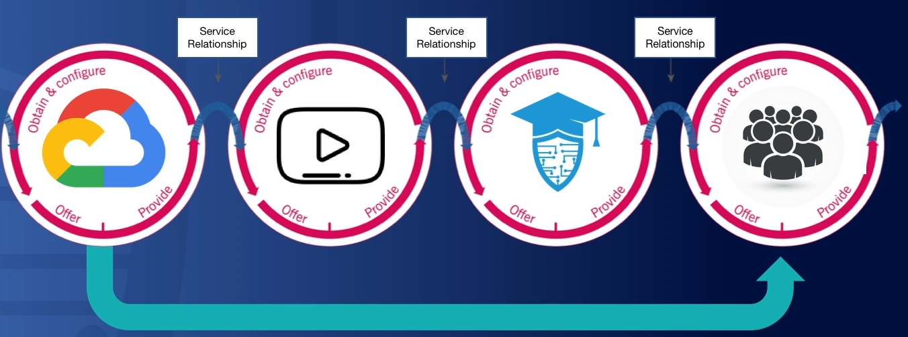
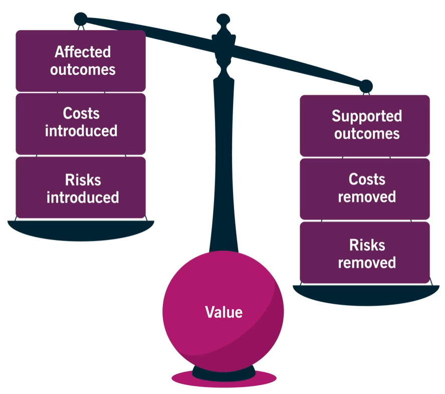
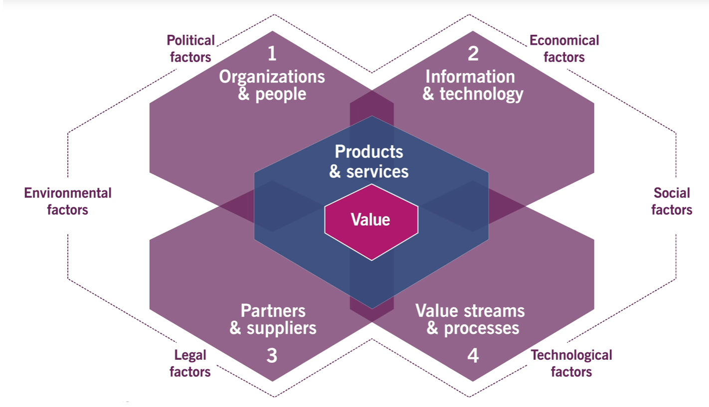

- [Section 1: Introduction](#section-1-introduction)
  - [Study Guide](#study-guide)
  - [What is ITIL?](#what-is-itil)
    - [ITIL 4](#itil-4)
- [Section 2: Service Management](#section-2-service-management)
  - [What is service management?](#what-is-service-management)
  - [What is orgnaisational capability?](#what-is-orgnaisational-capability)
  - [What is value?](#what-is-value)
  - [Organisations and People](#organisations-and-people)
    - [Service Providor](#service-providor)
    - [Consumer](#consumer)
  - [Services and Products](#services-and-products)
    - [Service](#service)
    - [Product](#product)
  - [Service Offerings](#service-offerings)
    - [Goods](#goods)
    - [Access to resouces](#access-to-resouces)
    - [Service Actions](#service-actions)
  - [Service Relationships](#service-relationships)
    - [Service Provision](#service-provision)
    - [Service Consumption](#service-consumption)
    - [Service Relationship Management](#service-relationship-management)
    - [Service Relationship Model](#service-relationship-model)
  - [Outcomes](#outcomes)
    - [Value Diagram](#value-diagram)
  - [Costs](#costs)
  - [Risks](#risks)
    - [As a consumer...](#as-a-consumer)
    - [Avoid, Accept, Transfer and Mitigate](#avoid-accept-transfer-and-mitigate)
  - [Utility and Warranty](#utility-and-warranty)
    - [Utility](#utility)
    - [Warranty](#warranty)
- [Section 3: The Basics of ITIL 4 (BONUS SECTION)](#section-3-the-basics-of-itil-4-bonus-section)
  - [Four Dimensions of Service Management](#four-dimensions-of-service-management)
    - [Organisations \& People](#organisations--people)
    - [Information \& Technology](#information--technology)
    - [Partners \& Suppliers](#partners--suppliers)
    - [Value Streams \& Processes](#value-streams--processes)
  - [Service Value System (SVS)](#service-value-system-svs)
  - [Guiding Principle](#guiding-principle)
  - [Service Value Chain](#service-value-chain)
    - [Inside of that service value chain block...](#inside-of-that-service-value-chain-block)
  - [Continual Improvement](#continual-improvement)

# Section 1: Introduction

## Study Guide

## What is ITIL?
ITIL, or Information Technology Infrastructure Library, was originally developed as a series of practices and guidlines on how to run an information technology organisation. 

### ITIL 4
It's no longer considered an acronym, but instead a brand name. It's now more than just infrastructure, and has since grown and expanded out of it's original meaning. 

# Section 2: Service Management
## What is service management?
A set of specialised organisational capabilities for enabling value to customers in the form of services. ITL can now be considered a framework for information technology service management, known as ITSM.

## What is orgnaisational capability?
Refers to having both the capacity and  the ability to perform the functions required. To do that, you need to organise your people to best support the activities, practices, and processes. 

## What is value?
The perceived benefits, usefulness, and importance of something. It's co-created by the supplier and consumer.

## Organisations and People
A person or a group of people that has its own functions, responsibilities, and relationships to achieve its objectives. People are organised around common goals within a larger business to achieve common objectives in a coordinated method.

### Service Providor
A role performed by an organisation in a service relationship to provide services to consumers.

### Consumer
A role performed by an organisation in a relationship that uses (or consumes) those services. 

## Services and Products

### Service 
Means of enabling value co-creation by facilitating outcomes that customers want to achieve, without the customer having to manage specific costs and risks. 

### Product
Configuration of resources created by the organisation that will be potentially valuable for its customers, combining and simplifying various services.
- Resources can be owned or managed by the organisation.

## Service Offerings
A description of one or more services designed to address the needs of a target consumer group. Can include goods, access to resources and service actions.

### Goods
Things that are transferred from the service provider to the consumer, and then the consumer is responsible for their future use.

### Access to resouces
Access to resources are granted or licensed to a consumer under agreed terms and conditions.

### Service Actions
Actions performed to address a consumer's needs.

## Service Relationships
A cooperation between a service provider and service consumer including service provision, service consumption, and service relationship management.

### Service Provision
The activities performed by an organisation to provide the services.

### Service Consumption
The activities performed by an organisation to consume the services.

### Service Relationship Management
The activities that the service provider and the service consumer do together to enable value co-creation to occur based upon the service offerings.

### Service Relationship Model

## Outcomes
A result for a stakeholder enabled by one or more outputs.

### Value Diagram
Value propositions change when the factors change.

## Costs
The amount of money spent on a specific activity or resource. Cost may be measuted in man hours or FTEs (Full Time Equivalent). 
- A service provider aims to reduce or remov costs for when providing a service.

## Risks
A possible event that could cause harm, loss or make it more difficult to achieve objectives.
- A service provider's goal should be to reduce risk for the consumer
- Consumers should contribute to the reduction of risk

### As a consumer...
1. Define the requirements of the service and clarify the required outcomes.
2. Clearly communicate any constraints and the critical success factors.
3. Consumers ensure providers have access to the necessary resources.

### Avoid, Accept, Transfer and Mitigate
1. Avoid - Involves removing risks from the service.
2. Accept - Used when the risk or cost is considered low.
3. Transfer - Used when you insure against a risk.
4. Mitigate - Used when you implement technology or processes to reduce the risk.

## Utility and Warranty
A service should have both utility and warranty.

### Utility
Functionality offered by a product or service to meet a particular need. "Fit for purpose".
- Requires that a service support the performance or remove constraints from the consumer.

### Warranty
Assurance that a product or service will meet agreed requirements. "Fit for use".
- Requires that a service has defined and agreed-upon conditions that are met.

# Section 3: The Basics of ITIL 4 (BONUS SECTION)

## Four Dimensions of Service Management

### Organisations & People
Focuses on the structure, roles, culture, and competence of an organisation. It ensures that teams are well-coordinated, skilled, and aligned to achieve service goals.

### Information & Technology
Involves the tools, technologies, and information systems used to deliver services. It includes IT infrastructure, applications, and data management practices necessary for service delivery.

### Partners & Suppliers
Relates to the relationships and contracts with external organisations. This dimension manages dependencies on third-party providers for resources, services, and products essential for service continuity.

### Value Streams & Processes
Defines the workflows and processes that create, deliver, and support services. It ensures efficient, consistent, and effective service delivery and optimisation.

## Service Value System (SVS)
Describes how all the components and activities of the organisation work together as a system to enable value co-creation.
- Requires integration and coordination of activities, practices, teams, authorities, and responsibilties.

## Guiding Principle
A recommendation that guides an organisation in all circumstances.
- Allows organisations to intergrate them into an overall approach to service management.
- Applied universally to any intiative
- Support organisations in continual improvement

1. Focus on value
2. Start where you are
3. Progress iteratively with feedback
4. Collaborate and promote visibility
5. Think and work holistically
6. Keep it simple and practical
7. Optimise and automate

## Service Value Chain
Uses interactions between practices. Each activity contributes to the service value chain by performing specific inputs or outputs.

### Inside of that service value chain block...

## Continual Improvement